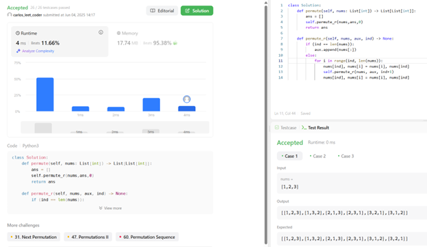
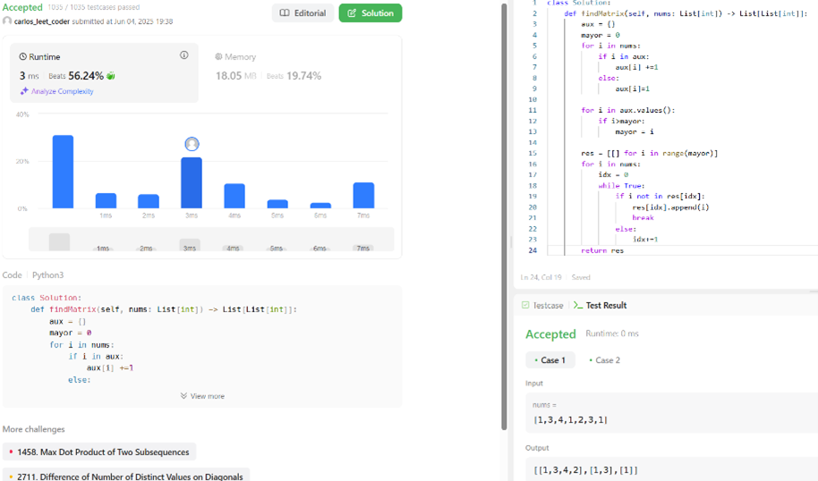

#  Individual LeetCode activity

> Solutions for: [46. Permutations](https://leetcode.com/problems/permutations/description/) and [2610. Convert an Array Into a 2D Array With Conditions](https://leetcode.com/problems/convert-an-array-into-a-2d-array-with-conditions/)

---

##  Technologies Used

-  **Languages**: Python / Java / Typescript 

---

##  Screenshots

| Permutations | Convert An Array |
|--------|----------------|
|  |  |

---